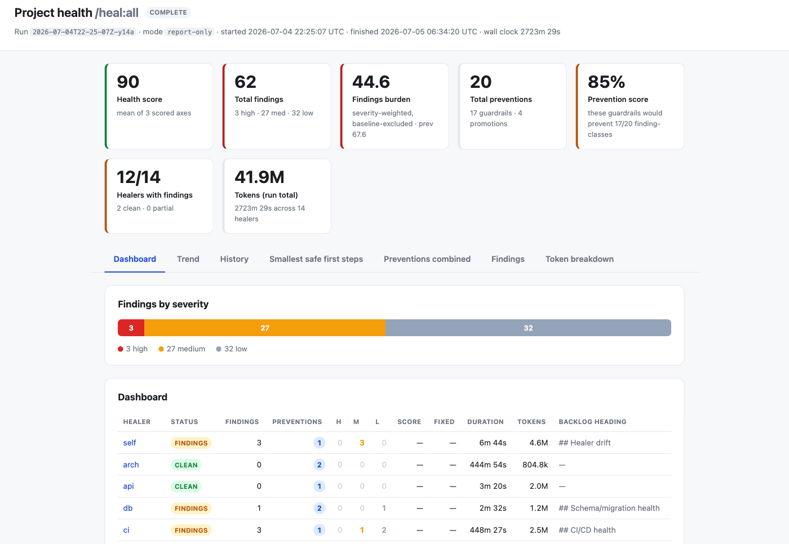

# Hi, I'm David 👋

Freelance full-stack engineer in Berlin. I code agentically: I build [Macrop](https://macrop.de),
a nutrition planner, and six open-source plugins for [Claude Code](https://code.claude.com)
that keep its codebase honest.


## Macrop

**A weekly meal planner where the numbers can't go wrong.**

[](https://macrop.de)

Every calorie and macro is calculated from the ingredients, never typed in — so when you swap a
meal or change an ingredient, your daily totals and shopping list just stay correct.

**[Try it →](https://macrop.de)** — public beta, sign-ups approved by hand.

## The Heal Suite

**A repo that audits, fixes and hardens itself.**

[](https://durchnull.github.io/heal-suite/demo-run.html)

18 healers check the code — architecture, security, tests, docs, speed and more. They run at
once and put what they find in one backlog. The mechanical fixes go out as small PRs. Problems
that keep coming back become gates, so they stop. Nothing merges without you.
Its first two sweeps of Macrop surfaced 61 and 72 findings and cut the measured maintenance
burden by a third.

**[Explore →](https://durchnull.github.io/heal-suite/)**
&nbsp;·&nbsp;
**[Sample run →](https://durchnull.github.io/heal-suite/demo-run.html)**
&nbsp;·&nbsp;
**[Repository →](https://github.com/durchnull/heal-suite)**

## Five more plugins

| Plugin                                              | What it does                                                                                                                       |
| --------------------------------------------------- | ---------------------------------------------------------------------------------------------------------------------------------- |
| **[plan](https://github.com/durchnull/plan)**       | Keeps your plan docs in order: write one, rank them, check them against git, hand one to a fresh session.                          |
| **[git](https://github.com/durchnull/git)**         | Ship, promote, release. It picks up your branch names and checks from the repo.                                                    |
| **[privacy](https://github.com/durchnull/privacy)** | Stops sensitive data — bank details, tax IDs, keys, names — before it lands in a file or a chat. You get `****6013` instead.       |
| **[render](https://github.com/durchnull/render)**   | Builds single-file HTML pages from your project's config: dashboards, reports, checklists, questionnaires.                         |
| **[observe](https://github.com/durchnull/observe)** | Watches how you work, if you let it: TL;DRs, saved questions, a log of what you want to get better at. Off until you switch it on. |

```text
/plugin marketplace add durchnull/claude-plugins
/plugin install heal@durchnull
```

## Available for freelance work

Full-stack product work — TypeScript, React Native, Laravel, AI.

**[durchnull.de →](https://durchnull.de)**
